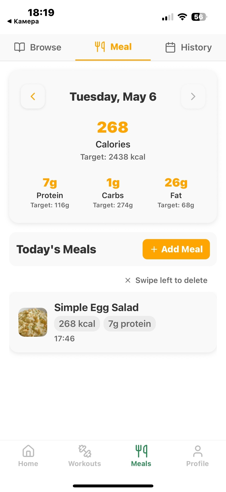

# Fitness Helper – Final Year Project

A mobile fitness app developed as part of a university final-year project. It helps users track workouts, plan meals, and receive AI-powered fitness coaching to support their health goals.

## Tech Stack

- **React Native (Expo)** – Cross-platform mobile development
- **Firebase** – Authentication, Firestore database, and cloud storage
- **TypeScript** – Type-safe development
- **OpenAI API** – Smart fitness and nutrition recommendations
- **ExerciseDB API** – 1300+ exercise database with instructions
- **Spoonacular API** – Nutrition data and recipe suggestions

## Features

- **User Authentication** – Sign up, login, and password reset with Firebase
- **Workout Tracker** – Log daily exercises and training types
- **Exercise Library** – Browse by body part, equipment, or target muscle
- **Meal Planner** – Search meals and view detailed nutritional info
- **Water Intake Tracker** – Log and monitor hydration levels
- **Progress Dashboard** – Visual summaries of workouts and meals
- **Streak System** – Motivational weekly workout streaks
- **AI Fitness Coach** – OpenAI-powered tips based on user activity
- **Data Export** – Export workouts, meals, and progress in CSV format
- **Profile Management** – Set goals and manage your health info

## Setup Instructions

1. **Clone the Repository**
   ```bash
   git clone https://github.com/Dorian144/fitness-helper.git
   cd fitness-helper
   ```

2. **Install Dependencies**
   ```bash
   npm install
   ```

3. **Set Up Environment Variables**
   
   Create your .env file using the template:
   ```bash
   cp .env.example .env
   ```
   
   Then fill in your keys in .env:
   - Firebase (API key, project ID, etc.)
   - OpenAI API key
   - Spoonacular API key
   - ExerciseDB (RapidAPI) key

4. **Start the App with Expo**
   ```bash
   npx expo start
   ```
   - Press i to open iOS simulator (Mac only)
   - Press a to open Android emulator
   - Scan QR code with Expo Go app

## Environment Setup Notes
This project uses both a .env file (excluded from Git) and a env.ts wrapper for importing environment variables into TypeScript files.

Never commit your .env file. Use .env.example for sharing safe defaults.

## Screenshots
You can find screenshots of the main features (Dashboard, Workouts, Meals, Profile) in the assets/screenshots/ directory.

### Sign-in Page


### Home


### Workout Browse


### Workout


### Workout History


### Meal Browse


### Meal


### Meal History


### Profile


## Disclaimer
This application was developed as part of a final-year university project. It is intended for educational and demonstration purposes only. While fully functional, it is not production-ready. API limits or billing restrictions may apply depending on your usage tier for OpenAI, Spoonacular, or ExerciseDB.

## License
MIT

## Contributing
This project is academic and not open for external contributions at this time.

